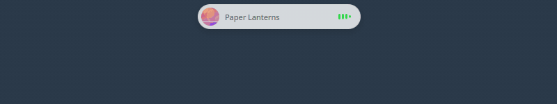

<!-- Before publishing: docs/RELEASE-CHECKLIST.md lists every placeholder in this file (OWNER/REPOSITORY, the hero video, the catalog's address). -->

# Dynamic Island for KDE Plasma 6

A pill at the top centre of the screen that shows what is going on right now (music, a timer, a download, a call, a notification) and opens into pages when the pointer rests on it.

[](#licence-and-thanks)


**English** · [Türkçe](README.tr.md)

<!-- TODO(owner): hero video / GIF here -->
> **The main video goes here.** It is being prepared by the owner; until then the short clips below show each page.

## Contents

- [What it is](#what-it-is)
- [Requirements](#requirements)
- [Installing, updating, removing](#installing-updating-removing)
- [First steps](#first-steps)
- [The island, state by state](#the-island-state-by-state)
- [The pages](#the-pages): [Activities](#activities) · [Media](#media) · [System](#system) · [Weather](#weather) · [Notifications](#notifications) · [Controls](#controls) · [Apps](#apps) · [Tools](#tools) · [Habits](#habits) · [Calendar](#calendar) · [Notes](#notes) · [AI](#ai) · [Cloud](#cloud) · [Clipboard](#clipboard)
- [Downloads and file transfers](#downloads-and-file-transfers)
- [Suggestions](#suggestions)
- [The cat](#the-cat)
- [Appearance, themes and the store](#appearance-themes-and-the-store)
- [Layout and language](#layout-and-language)
- [For developers: push your own activity](#for-developers-push-your-own-activity)
- [Performance](#performance)
- [Privacy and the network](#privacy-and-the-network)
- [Troubleshooting](#troubleshooting)
- [Known limits](#known-limits)
- [Contributing, security, licence](#contributing-and-security)

## What it is

| | |
|---|---|
| **Live activities** | The small pill shows the most important thing that is going on: music with its cover, a timer, a transfer with its progress, a screen recording, a call. Two at once split the island in two. |
| **Passing events** | Volume, brightness, charging, Bluetooth, Caps Lock, a new notification: shown for a few seconds, then the island is back where it was. |
| **Pages** | Hovering opens the island: Media, System, Weather, Notifications, Controls, Apps, Tools, Habits, Calendar, Notes, Clipboard, and (off until you switch them on) AI and Cloud. |
| **Out of the way** | A click shrinks it to a dot; clicks beside the island go to the window underneath. |
| **Your look** | It follows Plasma's colours, or wears a look of your own: colours or a gradient, opacity, blur, roundness. Looks can be exported as files. |
| **Yours to script** | Any program can show its own activity through a small D-Bus API (`island-push`). |
| **Private by default** | No telemetry. Nothing is asked of the network until you choose a place for the weather, connect a calendar or a notes app, or switch on AI or Cloud. See [Privacy and the network](#privacy-and-the-network). |

It is a Plasma widget (a plasmoid) written in QML, with an optional small native module (C++) for the parts QML cannot reach. Every part is optional and can be switched off.

## Requirements

| | |
|---|---|
| Desktop | KDE Plasma 6 (the widget declares Plasma API 6.0 as its minimum) |
| Tested on | Kubuntu 26.04, Plasma 6.6.6, Qt 6.10.2, KWin on **Wayland**, NVIDIA driver. Nothing else was tried. |
| X11 | **Not tested.** The click-through region is written for both, but only Wayland was tried (see [Known limits](#known-limits)). |
| To build the native module | `cmake`, `extra-cmake-modules`, Qt 6.5 or newer development files (Core, Gui, Qml, DBus, Network, Sql), `libkf6windowsystem-dev` |
| At run time | PipeWire's `pw-dump` (package `pipewire-bin` on Ubuntu) for the microphone, camera and screen-recording indicators |

Without the native module the widget still runs; what needs it hides itself: the shaped blur, clicks passing through beside the island, the recording, microphone and camera indicators, unlock, KDE Connect calls, the update count, the D-Bus API, calendar accounts and every password or key (they live in KDE Wallet), theme files, download tracking, the Cloud and AI helpers.

**Optional programs.** None is needed; each adds one thing.

| Program | What it adds |
|---|---|
| [rclone](https://rclone.org) | The Cloud page: your rclone remotes (Google Drive, OneDrive, Dropbox, WebDAV…) |
| [BetterNotes](https://github.com/thebanri/BetterNotes) 0.1.13+ | Notes on this computer, no account (0.1.14 to open a note in the app, 0.1.15 for locked notes) |
| Joplin (desktop), a Simplenote account, a Memos server | Their notes on the Notes page |
| KDE Connect | Phone battery, calls, notifications from the phone, "find my phone" |
| Claude Code (`claude`), Antigravity (`agy`) | The AI page answers through them, with every tool switched off |
| Ollama, LM Studio, llama.cpp, Jan, KoboldCpp | The AI page answers from a model on this computer |
| `btop` 1.4+ | A click on a System card opens that metric's graph in a terminal |
| Spectacle, Discover, a camera app | The matching buttons on the Controls page |
| PackageKit | The number of waiting updates |

## Installing, updating, removing

```bash
git clone https://github.com/OWNER/REPOSITORY.git
cd REPOSITORY
./install.sh               # the widget, the native module and island-push
systemctl --user restart plasma-plasmashell
```

`install.sh` asks for no password and downloads nothing: it installs the widget for your user with `kpackagetool6`, builds the native module with CMake and puts it in `~/.local/lib/qml`, puts `island-push` in `~/.local/bin`, and makes the module visible to plasmashell (`QML_IMPORT_PATH` in `~/.config/environment.d/90-dynamicisland.conf`). Running it again upgrades in place.

| | |
|---|---|
| Widget only, no native module | `./install.sh --no-native` |
| By hand | `kpackagetool6 -t Plasma/Applet -i org.phobby.dynamicisland` (`-u` to upgrade) |
| Update | `git pull`, then `./install.sh` and restart plasmashell |
| Remove | `./install.sh --remove`, then restart plasmashell |

Removing leaves your data where it is: `~/.local/share/dynamicisland/` (themes you added, what the suggestions learned, a kept AI chat), `~/.cache/dynamicisland/` (files fetched from a cloud), the folder "Dynamic Island" in KDE Wallet, and the widget's settings in Plasma's own file until you take the widget off the desktop. Delete them by hand if you want them gone.

**Putting it on the screen.** The island is a window of its own, so it does not matter where the widget goes:

1. Right click the desktop (or a panel in edit mode) → *Add Widgets…* → "Dynamic Island".
2. A small handle icon appears there; the island itself sits at the top centre of that screen.
3. With a panel at the top the island sits just below it. Settings → General → *Place below top panels* off puts it on the panel like a notch; then set *Distance from top*.

Plasma's own volume popup keeps appearing beside the island's. To keep only one: Settings → Activities → switch off "Volume, brightness and audio output" in the island, or switch off the volume popups in System Settings → Sound. (Plasma has no switch for its brightness popup.)

## First steps

- **Hover** the pill: it opens. Move away: it closes (after 0.4 s; both delays are in Settings → General).
- **The tabs** along the top switch pages; so does the mouse wheel or a two-finger swipe over anything that is not a list.
- **Click** the small pill: it shrinks to a dot. Click the dot: the pill is back. ([Dot mode](#dot-mode) can be switched off.)
- **Right click** the island for its menu; the gear at the top right of the open island opens the settings.
- **Settings → Layout** shows, hides and orders the pages. AI and Cloud are off until switched on there.
- **Language**: the island speaks Turkish when the system does, English otherwise; Settings → Language changes it at once.

## The island, state by state

<!-- GIF: island-states.gif | The small pill shows the clock, then a notification with its sender and first line, then an activity with a progress ring that ends in "Done". | The states of the small island -->
<p align="center"><br><sub>The states of the small island</sub></p>

| State | When | What you see |
|---|---|---|
| Idle | Nothing is going on | A small pill with the clock |
| Live activity | Something lasts (music, a timer, a transfer, a recording, a call) | Its icon or cover on the left, its time, value or progress ring on the right |
| Split | Two things last at once | The first in the pill, the second in a circle beside it |
| Notification | One arrives | App, title, first line. A click runs its default action, a middle click dismisses it |
| Passing event | Volume, brightness, charging, Bluetooth, Caps Lock, Wi-Fi… | A wide pill for 2–4 s |
| Suggestion | A rule's moment (see [Suggestions](#suggestions)) | A sentence with its answers as buttons |
| Open | Hover or click | The pages below |
| Privacy dots | Microphone or camera in use | An orange or green dot beside the island, in every state |
| Dot | After a click, in dot mode | A small circle in the pill's place |

Which activity wins when several last at once is a list you can reorder (Settings → Activities): privacy, call, screen recording, passing events, timer, transfers, media.

### Dot mode

<!-- GIF: dot-mode.gif | A click shrinks the pill to a dot; a window beside the dot is clicked; a click on the dot brings the pill back. | Dot mode -->

A click on the small pill turns it into a dot (15 px, 10–28 in the settings) so that it is out of the way; a click on the dot brings the pill back. The dot's centre says what is going on: orange, green or red for microphone, camera or screen in use; the accent colour for a live activity (pulsing) or waiting notifications. While it is a dot, notifications and events are kept and shown when the pill is back (or shown at once and then back to the dot: *Events in dot mode*). An incoming call, an alarm and low battery open it in every case unless you switch that off.

**Settings → General → Dot mode:** on/off, start as (as it was left, always the pill, always the dot), dot size, whether hovering opens it, events in dot mode, always open for critical events.

## The pages

### Activities

*Everything that is going on, with its buttons.* The page appears only while something is.

<!-- GIF: activities-page.gif | The open island on the Activities page with a running timer and a download, each with its own buttons. | The Activities page -->

- **What you see:** one card per ongoing activity (timer, transfer, recording, call, media…), with its actions, and which application uses the microphone or camera.
- **How to use:** the buttons on a card act on that activity (pause a timer, open the folder of a finished download, switch to the recording application).
- **Settings:** Settings → Activities: the priority order, the split island, how long a passing event stays, and a switch for every kind of event and activity.

### Media

*What is playing, and its controls.*

<!-- GIF: media-controls.gif | The pill shows a cover, a track's name and an equalizer; the next track comes; it is paused and played again. | Media on the pill: the track changes, pause and play -->
<p align="center"><br><sub>Media on the pill: the track changes, pause and play</sub></p>
<!-- GIF: media-page.gif | The open Media page: cover, title and artist, previous, play and next, the position being dragged. | Media: the page and its controls -->
<!-- GIF: media-glow.gif | With music playing the pill's edge starts to glow in the cover's colour and moves with the music; then the glow is switched off again. | Media: the ambient glow -->
<p align="center"><br><sub>Media: the ambient glow</sub></p>
<!-- GIF: media-cat.gif | The cat beside the pill puts on headphones and nods while music plays. | Media: the cat listens too -->
<p align="center"><br><sub>Media: the cat listens too</sub></p>

- **What you see:** on the pill the cover, the track's name and an equalizer; on the page cover, title, artist, position, previous / play / next.
- **How to use:** the buttons and the position bar control the player. The wave button at the top right switches the **ambient glow**: the island's edge takes the cover's colour and moves with the music's loudness and bass.
- **Settings:** Settings → General → *Preferred player* (for example `spotify`: shown when it plays, whatever else does). The glow is off by default.
- **Requirements and limits:** any player that speaks MPRIS (most do, browsers too). The glow follows the music only with the native module (it listens to the output through `pw-record` while something plays); without it the glow only takes the colour.

### System

*How busy the computer is.* Information only.

<!-- GIF: system-cards.gif | The System page: cards for CPU, temperature, GPU, memory, network and disk; the card under the pointer grows and shows details. | System: the cards -->

- **What you see:** cards for CPU, CPU temperature, GPU, memory, battery, network down/up and disk. In the *Dynamic* view the busiest cards are larger; in the *Fixed* view every card keeps its place.
- **How to use:** the card under the pointer grows and shows its details (the network card names the active connection). A click opens `btop` in your terminal with that metric's graph.
- **Settings:** Settings → General → *System view* (Fixed / Dynamic). Settings → Alerts: battery, device battery and temperature thresholds.
- **Requirements and limits:** the values come from Plasma's sensor service (ksystemstats), which the island starts if it is not running. A sensor the driver does not offer hides its card. The click needs the native module and `btop` 1.4 or newer.

### Weather

*Now and the next seven days, for a place you choose.*

<!-- GIF: weather-location.gif | The Weather page starts empty with "Choose a Location"; a city is typed and picked; the forecast appears; a day is clicked and its hours slide in. | Weather: choosing a place, a day's hours -->

- **What you see:** temperature, what it feels like, humidity and wind now; seven days with high, low and the chance of rain; the tab itself shows the weather's picture.
- **How to use:** it starts empty: *Choose a Location*, type a city, pick it. A click on a day shows its hours; the arrow goes back. The place's name opens the search again.
- **Settings:** Settings → Weather: the place (search, forget), units (°C, km/h, mm or °F, mph, in), the alert for rain, snow and storms.
- **Requirements and limits:** the data is [Open-Meteo](https://open-meteo.com)'s. The place is never detected, and nothing is asked until you choose one.

### Notifications

*The last notifications, with reply and dismiss.*

<!-- GIF: notifications-page.gif | Notifications arrive on the pill; the Notifications page lists the last three with their time; "Clear all" asks once and empties the list. | Notifications -->

- **What you see:** a new notification on the pill for a few seconds (app, title, first line); on the page the last three with their arrival time.
- **How to use:** on the pill a click runs the notification's default action, a middle click dismisses it. On the page, under the pointer: quick reply (where the notification offers one) and dismiss; *Clear all* asks once.
- **Settings:** Settings → General: show incoming notifications, for how long. While Do Not Disturb is on they are held back and counted.
- **Requirements and limits:** Plasma's own notification popups stay: the island shows notifications in addition (they can be moved to another corner in System Settings → Notifications).

### Controls

*Quick settings, like a phone's.*

<!-- GIF: controls-tiles.gif | The Controls page: Do Not Disturb and dark mode are switched, the volume slider is moved; holding a button makes them wiggle for editing. | Controls: buttons and sliders -->

- **What you see:** up to six buttons of your choice and, below, the volume and screen brightness sliders.
- **How to use:** a click switches a button. Holding one edits the set (drag to move, "−" to remove, add from the row below, *Done*). Holding **Bluetooth**, **Wi-Fi** or **VPN** opens its devices or networks instead.
- **Available buttons:** Do Not Disturb, Night Light, power profile, Bluetooth, Wi-Fi, updates, airplane mode, VPN, hotspot, record screen, screenshot, camera, microphone, sound, KDE Connect, find phone, dark mode, keep awake, lock, calculator, System Settings. A button whose part is missing is dimmed.
- **Settings:** Settings → Controls: the same six, in order. Settings → Layout → Modules: the volume slider.
- **Requirements and limits:** the brightness slider needs a display Plasma can dim. Buttons that start a program (screenshot, calculator, lock…) need the native module.

### Apps

*Shortcuts to the applications you choose.*

<!-- GIF: apps-grid.gif | The Apps page: "Add" lists the installed applications, one is added; a click starts it; two icons are dragged into another order. | Apps: add, start, reorder -->

- **What you see:** a grid of up to 12 icons; a dot under one means it has a window open.
- **How to use:** *Add* lists the installed applications with a search. A click starts one and closes the island; a right click renames or removes; dragging reorders.

### Tools

*Timer, stopwatch, Pomodoro and alarm.*

<!-- GIF: tools-timer.gif | A one-minute timer is started; the island closes and the pill counts down; the stopwatch takes laps; the Pomodoro's statistics are shown. | Tools: timer, stopwatch, Pomodoro -->

- **What you see:** four tools on one page; whichever runs shows on the pill as a live activity.
- **How to use:** set and start. The Pomodoro counts its rounds (focus, short break, long break) and keeps statistics: today, this week, the streak, the total.
- **Settings:** Settings → Tools: the sound (any file), Pomodoro lengths and rounds, reset the statistics.
- **Limits:** end times are stored, so a timer carries on if plasmashell restarts.

### Habits

*A daily checklist, an evening review, a calendar of how the days went.*

<!-- GIF: habits-checklist.gif | Habits are ticked on today's list; the evening question "How was today?" opens the review; the calendar shades the days like a contribution graph. | Habits: ticking, the evening review, the calendar -->

- **What you see:** today's list; a calendar that shades each day by how much was done (weeks, months, the year).
- **How to use:** the first time it asks for your habits and the time of the review. During the day a click ticks an entry. In the evening the island asks "How was today?": *Review* walks through the day and what to add for tomorrow.
- **Settings:** Settings → Habits: the habits (rename, delete, order), the review time (21:30), its reminder, the calendar's colours, reset all data.
- **Limits:** everything stays in the widget's settings on this computer.

### Calendar

*Your calendars' events, and the next one pinned to the island before it starts.*

<!-- GIF: calendar-connect.gif | The gear on the Calendar page opens "Connect a Calendar": Google or Apple is chosen, a link is pasted, the month fills with events. | Calendar: connecting one -->
<!-- GIF: calendar-pinned.gif | An event on the pill counts down its last seconds, turns into "started" with its room and a Join button, then shows the time left. | Calendar: the next event on the island -->
<p align="center"><br><sub>Calendar: the next event on the island</sub></p>

- **What you see:** a month, the events of the chosen day and their details (place, notes, a meeting link). 15 minutes before an event starts it is pinned to the pill with a countdown; at the start a sound plays and it stays 10 minutes after the end.
- **How to use:** the gear → *Connect a Calendar* → Google or Apple → either paste the calendar's private `.ics` link (read only), or connect the account (then events can be added and deleted from the island).
- **Settings:** Settings → Calendar: minutes before and after, all-day events, how often links are fetched (5 minutes), the sound, the connected calendars.
- **Requirements and limits:** no Akonadi or KDE PIM is needed. An iCloud account needs an app-specific password; a Google account needs an OAuth client of your own, made once in the Google Cloud Console (the page walks through it). Passwords and tokens are kept in KDE Wallet. Links are polled, so a new event shows after one interval at the latest; an existing event cannot be edited.

### Notes

*A quick note, and the notes of the apps you use.*

<!-- GIF: notes-quick.gif | On the Notes page a source is chosen, a note is created with a title and filled in; it appears in the list. | Notes: creating one -->
<!-- GIF: notes-locked.gif | A locked BetterNotes note asks for the master password on the island and then shows its text. | Notes: a locked note -->

- **What you see:** one list of the notes of every connected app, newest first, and a field for a quick note.
- **How to use:** type and press Enter for a quick note in the default app; the magnifier searches; a click opens a note for editing (saved when you stop typing, on Ctrl+S and when you go back). The island comes back to the note you were editing.
- **Sources:** BetterNotes (on this computer, no account), Joplin (its Web Clipper service and token), Simplenote (the account), Memos (your server and a token).
- **Settings:** Settings → Notes: the connected apps, where quick notes go, how often they are fetched, carrying on in the last note.
- **Requirements and limits:** tokens are kept in KDE Wallet. A locked BetterNotes note asks for the master password (BetterNotes 0.1.15 or newer; with an older one the island offers to open it in the app); the password goes to the command's standard input and is kept nowhere. Rich-text notes are shown as plain text and are read-only.

### AI

*A box for quick questions.* Off until you switch it on.

<!-- GIF: ai-question.gif | A question is typed on the AI page; three dots show that the answer is on its way; the answer appears as formatted text. Answered by a demo server with canned answers. | AI: a question and its answer (demo provider) -->

- **What you see:** a field, the answer as it is written (Markdown, code in boxes with *Copy*), and on the pill three dots while it is on its way and "Answer ready" when you were elsewhere.
- **How to use:** Settings → Layout: switch *AI* on. On the page connect what should answer, then type; Enter sends, Shift+Enter is a new line. *New chat* starts over; Escape gives the keyboard back.
- **What can answer:** Claude Code or Antigravity on this computer; a model server on this computer (Ollama, LM Studio, llama.cpp, Jan, KoboldCpp or any OpenAI-compatible address); a service with your own key (Anthropic, OpenAI, OpenRouter, Groq, Google Gemini or another OpenAI-compatible one).
- **Settings:** Settings → AI: the sources and the default one, the longest answer and question, *Keep the chat in a file*, "Answer ready" on the island.
- **Requirements and limits:** it is a question box, **not an agent**: nothing is given a tool or a file, and nothing of your clipboard, screen, notes or calendar is added. Keys are kept in KDE Wallet. A question to a service is sent to that service and may cost what that service charges. The chat is forgotten when the shell stops unless you choose to keep it.

### Cloud

*Your clouds' folders by name, through rclone.* Off until you switch it on.

<!-- GIF: cloud-browse.gif | The Cloud page lists a remote's folders; a folder is opened; a file is dragged out to the desktop; another is dropped in to upload. Shown with a made-up remote. | Cloud: browse, drag out, drop in (a made-up remote) -->

- **What you see:** each rclone remote with how full it is, its folders and files with size and date, a sync state where a client reports one (Syncthing, Dropbox), and a warning when a cloud is nearly full.
- **How to use:** Settings → Layout: switch *Cloud* on. Click into folders; drag a file out to the desktop or a file manager; drop files on the page to upload (it asks first). *Download*, *Show in folder*, *Copy path* and *Upload…* do the same without dragging.
- **Settings:** Settings → Cloud: which remotes are shown and under which name, the thresholds (90 % and 98 %), alerts and their pause, the question before an upload, the cache and *Clear cache*.
- **Requirements and limits:** needs `rclone` with at least one remote (`rclone config`); the page shows how to set it up when it is missing. The island only runs the `rclone` command: it can list, measure, copy from and copy to; it cannot delete, move, rename or sync. rclone's own configuration and tokens are never opened.

### Clipboard

*What was copied recently.*

<!-- GIF: clipboard-history.gif | The Clipboard page lists made-up copied texts and a picture; a click copies one again; the search narrows the list. | Clipboard -->

- **What you see:** the history of Plasma's own clipboard (Klipper): texts, code, pictures, files.
- **How to use:** a click copies an entry again; under the pointer: star, QR code, edit, Klipper's actions, remove. A search field and a starred-only filter.
- **Limits:** how much is kept is Klipper's own setting; the island stores nothing of it.

## Downloads and file transfers

<!-- GIF: downloads-tracking.gif | A download started with curl from a local test server appears on the pill with its megabytes and a ring that fills, then "Finished" with its size and time. | Download tracking (a download from a local test server) -->
<p align="center"><br><sub>Download tracking (a download from a local test server)</sub></p>

One kind of activity for everything that moves files: its name, "412 MB / 1.8 GB", per cent, speed, time left, and at the end a button to open the file or its folder.

| Source | What is shown |
|---|---|
| Dolphin, Ark, uploads to remote folders (KDE's job system) | Everything, exactly |
| KDE Connect, USB sticks and external disks | The same, through the job system |
| Browser downloads | Size, speed and time left, read from the download folder |
| `git clone`, `wget`, `curl`, `pip download` | Found by their process; bytes and speed from what they wrote |
| `apt`, PackageKit (Discover) | The stage and, where known, the progress |

**Settings → Download tracking:** the main switch, each source, background jobs, how long and how large something must be to be shown, the watched folders and commands. Commands are found by looking at the process list every three seconds; nothing is installed or wrapped. What was and was not tried with the real programs is in the [reference](docs/REFERENCE.md#file-transfers-what-can-and-cannot-be-tracked).

## Suggestions

<!-- GIF: suggestions-card.gif | A screen recording starts and the island asks whether to hide notifications, with Yes, Not now and Never suggest this; the settings page shows what was learned. | A suggestion and what it learned -->

At a few moments the island may ask one short question ("Hide notifications while the screen is recorded?") with three answers: yes, not now, never. From the answers it learns, per rule and per situation, whether to ask, to do it by itself (saying so, with an undo), or to stay quiet. Rules and counting only, on this computer: no network, no model.

The rules: Do Not Disturb before a calendar event, during a screen recording and in a Pomodoro focus round; pause media before a video meeting, when the microphone is used and when the headphones go away; power saving when the battery is low.

**Settings → Suggestions:** on/off (**off by default**: the island suggests nothing, and learns nothing, until you switch them on), the pause between two suggestions, every rule with its switch and what it has learned, and "forget".

## The cat

<!-- GIF: cat-sleep.gif | The cat beside the pill curls up and sleeps; a notification arrives and it looks up. | The cat: asleep and awake -->
<p align="center"><br><sub>The cat: asleep and awake</sub></p>
<!-- GIF: cat-petting.gif | The pointer strokes the cat from side to side and hearts rise. | The cat: stroking -->
<!-- GIF: cat-annoyed.gif | The sleeping cat is clicked; it gets annoyed and sulks. | The cat: woken up -->

A small cat sits beside the pill. It falls asleep when nothing happens (after 20 s), puts on headphones while music plays, thinks along while the AI answers, and looks up at events. Stroke it (move the pointer over it from side to side) and it likes that; click it while it sleeps and it does not. It changes nothing, keeps nothing and asks nothing of the network.

**Settings → Cat:** show it or not, the side, size, coat (grey, orange, black, white, tuxedo or a colour of your own), what it reacts to, whether it may be stroked and clicked, never angry, how long it sulks, when it falls asleep, hidden or asleep beside the dot, and **Reduce motion** (it then stands still: no nodding, no fidgets). With the desktop's own animations switched off it is still as well.

## Appearance, themes and the store

<!-- GIF: appearance-looks.gif | The same pill, with music playing, in four ready-made looks one after the other and back to the system's colours. | The same island in several looks -->
<p align="center"><br><sub>The same island in several looks</sub></p>
<!-- GIF: appearance-themes.gif | In the settings a ready-made look is chosen, a gradient is tuned and the island changes at once; the look is exported as a file and added again. | Appearance: looks, a gradient, export and add -->

**Settings → Appearance** has two modes.

- **Follow the system** (default): background, text and accent come from Plasma and change with it at once.
- **Custom:** ready-made looks (Oxygen Metallic, Breeze Dark, Breeze Light, Pure Glass, High Contrast and four gradients: Aurora, Sunset, Ocean, Midnight Blue) and fine tuning: opacity, blur, distance from the top, horizontal position, size (80–120 %), corner roundness, one colour or a gradient, the colours of controls and text, border, shadow. Every change shows on the island while the window is open. A look can be saved under a name.

**Theme files.** *Export Theme…* writes the look as one `*.islandtheme.json` file. *Add New…* takes one back, from a file or from the store. A theme is **data only**: at most 64 kB of JSON with known fields, no code, no QML, no pictures; anything else is refused, and a download whose checksum is not the catalog's is refused too. Themes you add are kept in `~/.local/share/dynamicisland/themes/`.

**The store** lists the `catalog/` folder of this repository. It makes a request only when you open its tab and when you press *Download*. Its address is one constant (`CATALOG_URL` in `contents/ui/ThemeFile.js`) and is a **placeholder until the repository is published**: until then the store says it has no address and asks nothing. Adding a theme of your own to the catalog: [CONTRIBUTING.md](CONTRIBUTING.md).

## Layout and language

<!-- GIF: layout-reorder.gif | In Settings → Layout a page is dragged to another place and one is switched off; the island's tabs follow. | Layout: ordering and hiding pages -->
<!-- GIF: language-switch.gif | Settings → Language is switched from English to Türkçe; the island's texts change at once. | Language -->

- **Settings → Layout → Tabs:** drag a page by its handle to move its tab; its switch shows or hides it. *Restore default order* puts them back. **Modules:** the parts inside a page that can be switched.
- **Settings → Language:** Automatic, Türkçe or English, for the island and its settings only, without restarting Plasma.

## For developers: push your own activity

Any program can show an activity on the island over D-Bus (service, path and interface `org.phobby.DynamicIsland`, on the session bus).

<!-- GIF: island-push.gif | An activity named "Backup" appears on the pill with a progress ring that fills, then a green "done". | An activity pushed with island-push -->
<p align="center"><br><sub>An activity pushed with island-push</sub></p>

```bash
island-push --id build --title "Build" --progress 40 --icon run-build
island-push --id build --progress 80 --subtitle "linking…"
island-push --id build --done --status success
island-push --flash --title "Backup done" --icon document-save --color green
```

```bash
source /path/to/REPOSITORY/tools/notify-done.sh    # in ~/.bashrc or ~/.zshrc
notify-done make -j16          # on the island while it runs, then "Done" or "Failed"; the exit code is kept
```

| Method | |
|---|---|
| `Push(s id, a{sv} props)`, `Update(…)` | Create or change an activity |
| `Finish(s id, s status)` | End it: `success`, `error`, `cancel` or `""` |
| `Flash(a{sv} props)` | A passing event |
| `List() → as` | The ids that are active |
| signal `ActivityClicked(s id)` | The user clicked it |

`props`: `title`, `subtitle`, `icon`, `progress` (0–100, −1 for none), `color` (`red`, `green`, `blue`, `orange`, `purple`, `gray` or `#rrggbb`), `trailing`, `priority`, `category`, `timeout` (seconds), `duration` (ms, Flash only). A Go example and `busctl` are in the [reference](docs/REFERENCE.md#d-bus-api). Needs the native module; Settings → Activities switches the API off.

## Performance

<!-- PERF:BEGIN -->
*Measurements are being added; see [docs/PERFORMANCE.md](docs/PERFORMANCE.md).*
<!-- PERF:END -->

## Privacy and the network

There is **no telemetry**: the island reports nothing to anybody, and has no account. With the settings as they come, it makes **no network request at all** (checked: 170 s of a fresh start with default settings under `strace`, no connection outside the computer). What each part does once you use it:

| Part | Talks to the network | Starts programs | Keeps on disk |
|---|---|---|---|
| The island itself, System, notifications, media | never | `pw-dump` (one, for the microphone/camera/recording indicators); Plasma's sensor service | its settings, in Plasma's own settings file |
| Ambient glow (off by default) | never | `pw-record` while music plays | nothing |
| Weather | Open-Meteo, **only after you choose a place**: the name you type goes to its search, the place's coordinates to its forecast (at most every 15 minutes) | none | the place, in the settings |
| Calendar | **only after you connect one**: the `.ics` links you pasted (every 5 minutes), or iCloud / Google for a connected account | the browser, once, for the Google sign-in | links and account names in the settings (a private link is a secret: it is stored as plain text there); passwords and tokens in KDE Wallet |
| Notes | **only for a connected app**: Joplin on this computer, Simplenote's servers, your Memos server; BetterNotes never | the `betternotes` command | tokens in KDE Wallet (the notes themselves stay in their apps) |
| AI (off by default) | **only when you send a question**, to the source you chose | `claude` or `agy` for those sources | keys in KDE Wallet; the chat only if you ask for it (`~/.local/share/dynamicisland/ai-chat.json`, readable by you only) |
| Cloud (off by default) | through `rclone`, for the remotes you set up: a listing when you open a folder, how full each cloud is every three hours | `rclone`; `dropbox status` if you use it | files you fetched, in `~/.cache/dynamicisland/cloud` (with a size limit) |
| Theme store | **only when you open its tab** or press Download (and not at all while its address is the placeholder) | none | themes you add, in `~/.local/share/dynamicisland/themes/` |
| Updates | never (it reads PackageKit's list on this computer) | none | nothing |
| Download tracking | never | none (it reads the process list and the download folder) | nothing |
| Suggestions | never | none | what it learned, in `~/.local/share/dynamicisland/suggestions.json` |
| Habits, Pomodoro, Apps, Tools | never | the applications you start | their data, in the settings |
| Clipboard | never | none | nothing (the history is Klipper's) |
| D-Bus API | never | none | nothing |

Three more things worth knowing:

- **A page that is switched off does no work.** AI and Cloud are not even loaded while they are off. With every page and watcher switched off the island measured the same as a desktop without it (see [Performance](#performance)).
- **What others write is shown as plain text.** A notification's title, a track's name, a file's or a network's name is never read as markup, so it cannot make the island fetch a picture from somewhere.
- **Programs are started without a shell**, each argument on its own; a password for a locked note goes to the program's standard input, never onto its command line.

## Troubleshooting

| | |
|---|---|
| The island does not appear | Restart plasmashell after installing (`systemctl --user restart plasma-plasmashell`), then add the widget. Logs: `journalctl --user -f \| grep -i -E "dynamicisland\|qml"` |
| No blur, clicks beside the island do not pass through, pages say the native module is missing | The native module is not installed or plasmashell does not see it: run `./install.sh` (not `--no-native`) and restart plasmashell. After a Plasma or Qt update, run it again |
| Where exactly does the island take clicks? | Start plasmashell with `DYNAMICISLAND_DEBUG_REGION=1` in its environment: a red outline is drawn around the region (`systemctl --user set-environment DYNAMICISLAND_DEBUG_REGION=1`, restart plasmashell; `unset-environment` afterwards) |
| Typing into the island | The island never takes the keyboard by itself. It takes it when a field is clicked (Notes, AI, a reply) and gives it back with Escape; while it has it, the island stays open |
| BetterNotes: cannot save, cannot open, a locked note | Saving needs BetterNotes 0.1.13, opening a note in the app 0.1.14, locked notes 0.1.15. Quit a running older BetterNotes and start it again after updating. `betternotes --diagnostics` prints its own report |
| Cloud: "rclone was not found" | Install rclone and add a remote in your own terminal (`rclone config`); the page shows the commands to copy and runs none of them |
| Weather shows nothing | It starts empty on purpose: *Choose a Location* on the page |
| A scroll turns the page instead of the list (or the other way round) | `QT_LOGGING_RULES="island.wheel.debug=true"` in plasmashell's environment logs who got each wheel step |
| Volume shows twice | Plasma's own popup and the island's: see the end of [Installing](#installing-updating-removing) |
| A keyboard shortcut to open the island | There is none of the island's own. Plasma's per-widget shortcut was not tried |
| The journal lists `qt.qml.usedbeforedeclared … IcsWorker.js` at every start | Harmless: they come from the calendar library (ical.js), which is shipped unmodified |
| To look at every pose of the cat | `DYNAMICISLAND_CAT_GALLERY=1` in plasmashell's environment opens a window with all of them |

## Known limits

- **Only one setup was tested:** Plasma 6.6.6 on Wayland with an NVIDIA card, one monitor. X11, other compositors' versions, several monitors and a screen too narrow for the cat's side were not tried. On X11 the click region also clips what is drawn, so the shadow and the glow may be cut.
- **The island sits on the screen** of the desktop or panel the widget was added to.
- **Notifications appear twice**, Plasma's popup and the island's. The island can stay above full-screen windows.
- **Dragging onto the island:** only the visible island takes a drag; dragging a file between the island and another program was written the way Qt offers it but could not be tried between two programs.
- **Download tracking:** tried with a Flatpak browser, `git clone`, `wget`, `curl`, `pip download`, `apt download` and a PackageKit download. `sudo apt update/install`, a Chromium browser, Firefox as a Snap and pausing inside the browser were not tried.
- **Calendar:** links are polled; an existing event cannot be edited from the island; an event may be pinned up to 20 s late. A calendar link may send up to 10 MB and take up to 30 seconds; one that is larger or slower is not read (the island says so and keeps showing its last good copy).
- **AI:** that Claude Code stays a question box rests on the command honouring its own options; the island checks what the command says about itself before every answer and stops it otherwise. The model servers other than Ollama were not installed here; a chat with a real key was tried against a stand-in, only a refused key against the real services.
- **Cloud:** there is no sync state for Google Drive, OneDrive or Nextcloud through rclone; Syncthing's and Dropbox's were tried against stand-ins.
- **Updates** count PackageKit's packages (apt, dnf); Flatpak updates are not counted.
- **KDE Connect** has no "call ended" signal: the call activity ends when its notification closes.
- **Bluetooth headphones** give one battery value, not left, right and case.
- **The D-Bus API** belongs to one island at a time (the first that registers); a second "dynamic island" widget beside this one overlaps it.

The long list, with what was tried for each part, is in the [reference](docs/REFERENCE.md#known-limitations).

## Contributing and security

- **Code, tests, a theme for the store:** [CONTRIBUTING.md](CONTRIBUTING.md). `tools/run-tests` runs every check that needs no running island.
- **A security problem:** [SECURITY.md](SECURITY.md). Please do not open a public issue for it.
- **How it is built:** [docs/ARCHITECTURE.md](docs/ARCHITECTURE.md). Every feature in detail: [docs/REFERENCE.md](docs/REFERENCE.md). What changed: [CHANGELOG.md](CHANGELOG.md).

<!-- TODO(owner): roadmap. Only what the owner has decided goes here. -->

## Licence and thanks

The island is free software under the **GNU General Public License, version 2 or (at your option) any later version** (`GPL-2.0-or-later`); its text is in [LICENSE](LICENSE).

It stands on the work of others; the full list with every licence is in [docs/CREDITS.md](docs/CREDITS.md):

- [KDE Plasma](https://kde.org/plasma-desktop/) and Qt, which it is a widget of.
- [Lucide](https://lucide.dev) (ISC; some of its icons come from Feather, MIT): the weather pictures and the AI tab's sparkles.
- [ical.js](https://github.com/kewisch/ical.js) (MPL-2.0): reading calendar files.
- [Open-Meteo](https://open-meteo.com): weather data, licensed under [CC BY 4.0](https://creativecommons.org/licenses/by/4.0/).
- [Simple Icons](https://simpleicons.org) (CC0): the marks that label the Apple and Google calendar options and the Joplin and Simplenote sources. They are trademarks of their owners.
- [BetterNotes](https://github.com/thebanri/BetterNotes) (MIT): its icon, and thanks for the command-line interface the Notes page talks to.
- The music and covers in the clips above were made for this project by `tools/demo/make-media` and are free to use (CC0).
