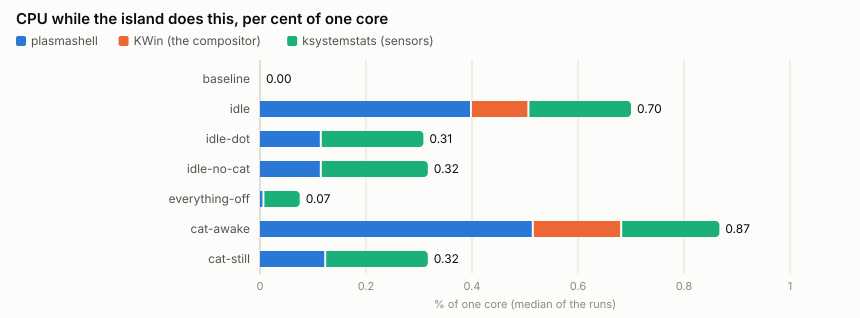

# What the island costs to run

Measured, not estimated. The figures below hold for **one machine**; on
another they will differ, mostly with the display's refresh rate and the
graphics driver. How to take your own is at the end.

<!-- RESULTS:BEGIN -->
## The figures

Taken on 2026-10-07, of the island's code with the id `06a20c85fc2e` (a checksum of `org.phobby.dynamicisland/` and `native/`: `tools/bench/done code` says a checkout's, [`perf/raw/done.tsv`](perf/raw/done.tsv) the one of every file). **The island's code has changed since, and nothing was measured again:** the figures are of that code, not of this checkout's.

| Scenario | runs | plasmashell CPU % (lowest–highest run) | over baseline | 1 s p95 / max | KWin % | sensors % | wakeups/s | child processes/h | RSS MB | PSS MB |
|---|---|---|---|---|---|---|---|---|---|---|
| `baseline`: the same shell and desktop without the island | 2 | **0.00** (0.00–0.00) | – | 0 / 0 | 0.00 | – | 0 | 0 | 212 | 68 |
| `idle`: the pill with the clock, default settings; the cat has fallen asleep | 3 | **0.40** (0.38–0.40) | +0.40 | 1 / 2 | 0.11 | 0.19 | 66 | 0 | 284 | 123 |
| `idle-dot`: shrunk to a dot (the cat hidden) | 3 | **0.12** (0.12–0.12) | +0.12 | 1 / 2 | 0.00 | 0.19 | 4 | 0 | 283 | 122 |
| `idle-no-cat`: the pill, default settings, without the cat | 3 | **0.12** (0.11–0.12) | +0.12 | 1 / 2 | 0.00 | 0.20 | 4 | 0 | 282 | 120 |
| `everything-off`: every page, module, alert and watcher switched off | 3 | **0.01** (0.00–0.02) | +0.01 | 0 / 2 | 0.00 | 0.07 | 0 | 0 | 263 | 110 |
| `cat-awake`: the cat kept awake (sitting, its fidgets) | 3 | **0.52** (0.52–0.69) | +0.52 | 3 / 6 | 0.17 | 0.18 | 107 | 0 | 283 | 123 |
| `cat-still`: the cat with "Reduce motion" | 1 | **0.12** (0.12–0.12) | +0.12 | 1 / 1 | 0.00 | 0.19 | 4 | 0 | 339 | 175 |

Runs: three for every scenario, but `baseline` has 2 and `cat-still` has 1. A run that was cut off (the computer went off), or was not taken whole, has no mark in `done.tsv` and is not counted. "–" under sensors: the daemon was not running (without the island nothing starts it).

<p align="center"></p>

### The start of the shell

`tools/bench/startup`: plasmashell is started 5 times without the island and 5 times with it; the median, with the lowest and the highest.

| | Seconds |
|---|---|
| Until the shell answers on D-Bus, without the island | 0.30 (0.28–0.30) |
| The same, with the island | 0.47 (0.45–0.48) |
| Until the island's own D-Bus service is there | 0.48 (0.46–0.49) |

## Not measured yet

No figure is given for any of these; `tools/bench/chain` takes all but the last two ("Taking your own" below).

- `media`: music playing; glow off, no cat
- `media-glow`: music playing; the glow follows it, no cat
- `media-glow-cat`: music playing; glow, and the cat nods with its headphones
- `media-cat`: music playing; no glow, the cat with its headphones
- `theme-flat`: an opaque, flat look (Midnight), no blur
- `theme-glass`: a see-through look with blur (Glass)
- `theme-gradient`: a gradient with blur (Aurora)
- `notifications`: 200 notifications, one every 0.4 s
- `activity`: an activity of the D-Bus API that changes every second
- `download`: curl downloading at 16 MB/s, tracked on the pill
- `background`: weather for a place, two calendars and BetterNotes, each asked once a minute
- Frames per second and frame times (`tools/bench/run --frames`).
- The long run of two hours (`tools/bench/soak`): whether memory, threads or file descriptors grow.
- Energy in watts: see "Energy" below.
- The scenarios that need a pointer (`hover`, `page`, `cat-petting`): see "What could not be measured" below.
<!-- RESULTS:END -->

## Since the measurements

*Written for 0.1.0, on 2026-10-08.* After the figures above were taken, three
things changed in the island, and no scenario was measured again:

- a calendar's link is fetched another way (at most 10 MB and 30 seconds);
- suggestions are off by default. They were **on** when the scenarios with
  default settings were measured (`idle`, `idle-dot`, `idle-no-cat`,
  `cat-awake`, `cat-still`), so those are of an island with suggestions
  switched on;
- the version number and the website in the widget's `metadata.json`, and the
  address of the theme store.

`cat-still` rests on a single run, and that run's memory (339 MB resident) is
56 MB above every other scenario with the island. Nothing explains it yet;
until it is measured three times, take the scenario as not measured.

[`perf/raw-before/`](perf/raw-before/) holds an earlier series of the same
day, taken before the equalizer, the dot's pulse and the blink of a recording
were made to draw in steps. It has no marks (`done.tsv` came later), so which
code exactly it measured is not recorded. No figure on this page or in the
READMEs comes from it. It is the only place where music was measured, and the
code that plays it has changed since: so there is no figure for music.

## The machine

| | |
|---|---|
| Kind | Desktop PC (no battery) |
| Processor | AMD Ryzen 5 7500F, 6 cores / 12 threads, `amd-pstate-epp`, governor and power profile "performance" |
| Memory | 30 GiB |
| Graphics | NVIDIA GeForce RTX 4060, proprietary driver 595.91.07 |
| Display | 2560×1440 at 180 Hz, scale 1 (the measurements' own screen: 1920×1080 at 60 Hz, see below) |
| System | Ubuntu 26.04.1 (Kubuntu), Linux 7.0.0-38 |
| Desktop | Plasma 6.6.6, KWin 6.6.6 on Wayland, Qt 6.10.2 |

## How it was measured

**Where.** In `tools/nested-session`: a second KWin with its own D-Bus, home
and settings, an empty desktop of one colour, no panel, and `plasmashell` with
only this widget. It is **headless**: KWin draws with the GPU into a screen of
1920×1080 at 60 Hz that nobody sees, so the measurement does not depend on
what else is on the real screen, and the real desktop can be used or locked
meanwhile. The **baseline** is the same shell and desktop without the widget;
"over baseline" is the difference.

**What.** `tools/bench/sample` reads, once a second, from `/proc`:

- **CPU time** of the process, user + system, all threads
  (`/proc/<pid>/stat`): the time the kernel accounted, not a percentage some
  tool smoothed. It comes in steps of 10 ms, so one second reads 0, 1, 2 … per
  cent; a figure like 0.68 % is the whole time over the whole run.
- **CPU time of its children** that ended (`cutime + cstime`) and the
  **child processes it started** (seen by looking at `/proc` ten times a
  second).
- **Memory**: resident (RSS) and proportional (PSS, shared pages divided by
  their sharers) from `smaps_rollup`.
- **Threads**, **open file descriptors**.
- **Wakeups**: voluntary context switches of all its threads, per second. A
  thread that sleeps and is woken counts one; a process that lets the
  processor sleep has few.
- **GPU**: the process's share as `nvidia-smi pmon` reports it.

Besides `plasmashell` the session's **KWin** is sampled (drawing the island
costs the compositor too) and **ksystemstats**, Plasma's sensor daemon, which
the island's System page starts and keeps asking.

**How often.** Every scenario three times; each time a fresh shell and widget
with default settings plus the scenario's, 60 s left alone, then 120 s
sampled. The table has the median of the runs (three, where it does not say
fewer) with the lowest and the highest, and the 95th percentile and the
maximum of all single seconds.

**What the headless screen changes.** It refreshes 60 times a second; the
real display here 180 times. Anything that animates on every frame (the
island opening, a page sliding, the equalizer bars) draws three times as
often on the real display, and costs accordingly more there. Scenarios that
are still, or step a few times a second (the sleeping cat: 3 pictures a
second), do not depend on it. No figure on this page was taken on the real
desktop.

## Energy

**Not measured in watts.** The processor's own energy counter (RAPL,
`/sys/class/powercap/intel-rapl:0/energy_uj`) exists on this machine but is
readable by root only; the graphics card reports no power draw
(`nvidia-smi`: N/A); a desktop PC has no battery to read a discharge from. No
figure in watts is given here, and none was derived from a model.
`tools/bench/energy` reads the processor's counter when run with `sudo`; the
difference between a scenario and the baseline, on a quiet machine, would be
the island's share.

What stands in for it:

- **CPU seconds per hour**: 1 % of one core is 36 CPU seconds an hour.
- **Wakeups per second**: how often the island keeps the processor from
  sleeping.
- **Child processes** started, and **network requests** made (none at idle:
  see the README's privacy table).

## What could not be measured

- **Anything that needs a pointer**, headless: hovering, an open page,
  scrolling a list, stroking the cat. KWin takes input only from programs it
  knows. Those scenarios have to be played on the real screen with a scripted
  pointer (`tools/demo/pointer`); that has not been done yet.
- **Frame times while scrolling**, for the same reason.
- **Watts** (see above).
- **Other hardware**: an integrated GPU, a laptop on battery, a 60 Hz or a
  4K display, X11.

## Taking your own

```bash
tools/bench/chain                                           # everything below, in the background; goes on where it was cut off
tools/bench/chain --status                                  # what is measured, what is left, how long that takes
# or piece by piece:
tools/bench/run --list
tools/bench/run --reps 3 --warmup 60 --duration 120 all     # about three hours; your desktop stays usable
tools/bench/soak --hours 2
tools/bench/summarize                                       # docs/perf/summary.md, cpu.svg, soak.svg
tools/bench/summarize --readme                              # and the figures of this page and of both READMEs
# the shell you are sitting in, as it is:
tools/bench/sample --pid "$(pgrep -x plasmashell)" --children --gpu --duration 120 --out /tmp/my-shell.csv
```

The raw CSV files of the figures here are in [`perf/raw/`](perf/raw/);
`done.tsv` beside them says which code each measured and when
([`tools/bench`](../tools/bench/README.md)).
